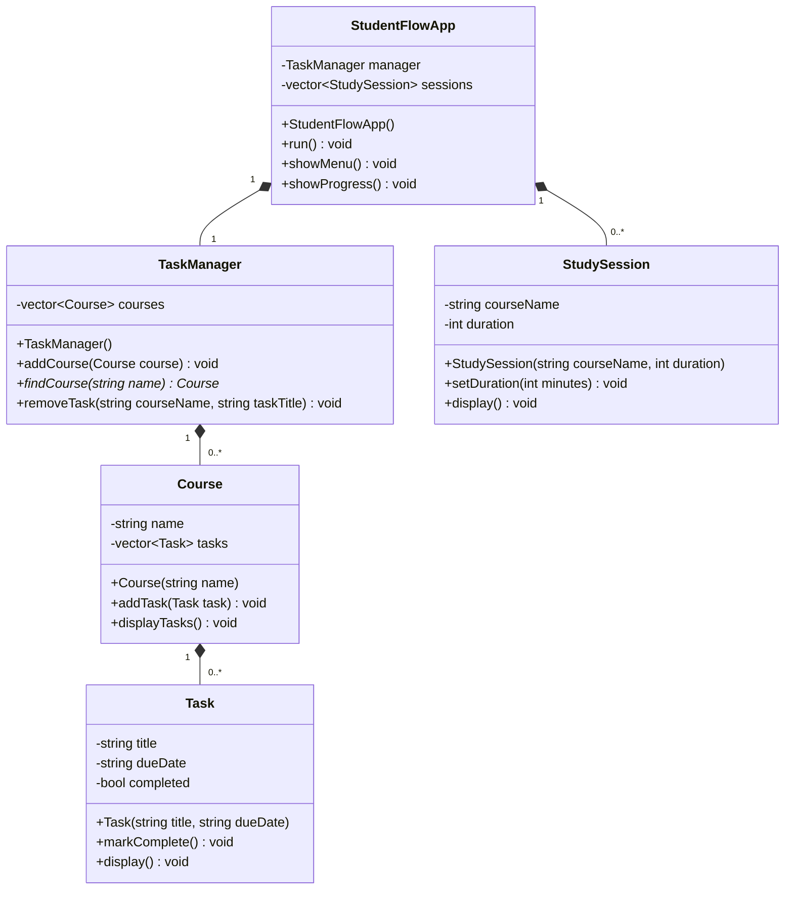

# StudentFlow

```mermaid
classDiagram
    class Task {
        -string title
        -string dueDate
        -bool completed
        +Task(string title, string dueDate)
        +markComplete() void
        +display() void
    }

    class Course {
        -string name
        -vector~Task~ tasks
        +Course(string name)
        +addTask(Task task) void
        +displayTasks() void
    }

    class TaskManager {
        -vector~Course~ courses
        +TaskManager()
        +addCourse(Course course) void
        +findCourse(string name) Course*
        +removeTask(string courseName, string taskTitle) void
    }

    class StudySession {
        -string courseName
        -int duration
        +StudySession(string courseName, int duration)
        +setDuration(int minutes) void
        +display() void
    }

    class StudentFlowApp {
        -TaskManager manager
        -vector~StudySession~ sessions
        +StudentFlowApp()
        +run() void
        +showMenu() void
        +showProgress() void
    }

    Course "1" *-- "0..*" Task
    TaskManager "1" *-- "0..*" Course
    StudentFlowApp "1" *-- "1" TaskManager
    StudentFlowApp "1" *-- "0..*" StudySession
```
